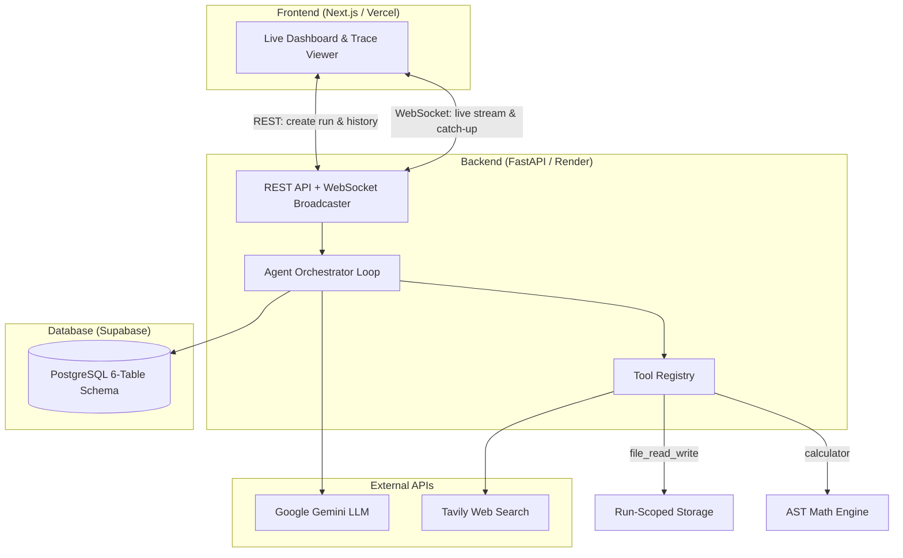

# Autonomous Research Agent

An autonomous AI research agent with a live real-time dashboard. You provide a natural-language research question or topic; the agent breaks it into an actionable multi-step plan, invokes specialized tools (web search, file I/O, calculator), evaluates results with automated self-reflection, dynamically re-plans upon tool failures, and synthesizes a structured Markdown report with citations and honest limitations disclosure — all streamed live to the browser via WebSockets.

---

## Live Deployments

- **Frontend Dashboard (Vercel):** `https://research-agent-five-delta.vercel.app/` 
- **Backend Health Check (Render):** `https://research-agent-rpkp.onrender.com/health` 

> **Note on Render Free Tier:** The backend is deployed on Render's free tier, which automatically spins down after 15 minutes of inactivity. When submitting your first research goal or checking health after a period of dormancy, the server may take **30–60 seconds** to wake up. The frontend includes a real-time status banner notifying you during cold-start delays.

---

## Architecture Overview

The system is architected as an asynchronous, event-driven agentic pipeline divided across three primary tiers:

1. **Frontend Tier (Next.js App Router):** A reactive TypeScript dashboard that initiates research sessions via REST and maintains a persistent WebSocket connection to stream live execution traces, plan checklists, and final reports without client-side polling.
2. **Backend Engine (FastAPI + Agent Orchestrator):** Manages the goal decomposition loop, tool registry execution, LLM-driven observation reflection, dynamic re-planning, and report compilation.
3. **Database Tier (Supabase PostgreSQL):** Persists all entities across 6 relational tables (`runs`, `plans`, `steps`, `tool_calls`, `observations`, `reports`), providing complete step-level auditability.



*For complete Mermaid sequence diagrams and database ER schemas, see [`docs/design-doc.md`](docs/design-doc.md).*

---

## Tech Stack & Reasoning

Directly derived from our system design decisions ([`docs/decisions.md`](docs/decisions.md)):

| Component | Choice | Reasoning |
|---|---|---|
| **Backend Framework** | Python + FastAPI | Fast async performance, automatic OpenAPI documentation, and robust ecosystem for LLM agent tooling and WebSockets. |
| **Frontend Framework** | Next.js (TypeScript, Tailwind CSS) | React App Router with responsive styling, SSR/client streaming support, and first-class Vercel integration. |
| **LLM Provider** | Google Gemini API (`gemini-flash-latest`) | High context capacity, rapid inference speed, and strong structured JSON generation for planning and synthesis. |
| **Database & ORM** | Supabase (PostgreSQL) + SQLAlchemy & Alembic | Managed PostgreSQL with schema migrations and reliable relational logging for every agent step and observation. |
| **Search Engine** | Tavily Web Search API | Search results tailored specifically for LLM extraction, returning clean snippets without HTML overhead. |

---

## Built-in Tools

The agent utilizes a modular `BaseTool` registry equipped with three core tools:

* **`web_search`:** Queries the live web for authoritative facts, statistics, and literature with normalized result extraction and automatic error handling.
* **`file_read_write`:** Reads, writes, and appends intermediate research notes in a run-isolated workspace directory (`backend/storage/runs/{run_id}/`) with strict path-traversal security guards.
* **`calculator`:** Safely evaluates arithmetic expressions, formulas, and percentages via AST parsing with automatic input sanitization to eliminate numeric hallucinations.

---

## Re-planning & Stopping Condition

* **How Re-planning Works:**  
  After executing each step, the agent evaluates the tool output and classifies the result (`success`, `insufficient`, `transient_failure`, or `hard_failure`). If an action returns incomplete or failed data, the orchestrator triggers dynamic re-planning — reformulating queries or modifying remaining steps in a newly versioned plan (`is_current = True`) rather than halting or repeating errors.

* **How the Stopping Condition Works:**  
  The agent stops when all planned steps are completed and a final research report is synthesized. To guarantee safety and prevent infinite loops, the orchestrator enforces a hard safety cap on maximum steps, limits retries per step (`skip_and_flag`), and honestly documents any missing data or skipped actions in the report's **Limitations & Gaps** section.

---

## Local Setup Instructions

### Prerequisites
* **Python 3.10+**
* **Node.js 18+** and `npm`
* **PostgreSQL** database (Supabase or local instance)
* **Google Gemini API Key** ([Google AI Studio](https://aistudio.google.com/))
* **Tavily API Key** ([Tavily AI](https://tavily.com/))

### 1. Clone the Repository
```bash
git clone https://github.com/moeezahmed099/Research_Agent.git
cd Research_Agent
```

### 2. Configure Environment Variables

**Backend (`backend/.env`):**
```bash
cp backend/.env.example backend/.env
```
Edit `backend/.env`:
```ini
DATABASE_URL=postgresql://postgres:[YOUR-PASSWORD]@[YOUR-HOST]:5432/postgres
GEMINI_API_KEY=your_gemini_api_key_here
SEARCH_API_KEY=your_tavily_search_api_key_here
GEMINI_MODEL=gemini-flash-latest
```

**Frontend (`frontend/.env.local`):**
```bash
cp frontend/.env.example frontend/.env.local
```
Edit `frontend/.env.local`:
```ini
NEXT_PUBLIC_BACKEND_URL=http://localhost:8000
```

### 3. Backend Setup
```bash
cd backend
python -m venv venv

# Windows
venv\Scripts\activate

# macOS / Linux
source venv/bin/activate

pip install -r requirements.txt
alembic upgrade head
uvicorn main:app --reload --port 8000
```
Verify the backend at: [http://localhost:8000/health](http://localhost:8000/health) & [http://localhost:8000/docs](http://localhost:8000/docs).

### 4. Frontend Setup
In a new terminal:
```bash
cd frontend
npm install
npm run dev
```
Open the live dashboard at: [http://localhost:3000](http://localhost:3000).

---

## Evaluation Results Summary

The agent underwent a rigorous 8-goal evaluation suite across straightforward lookups, multi-subtopic comparisons, arithmetic pipelines, ambiguous goals, and deliberate tool failures ([`docs/evaluation.md`](docs/evaluation.md)).

**Key Findings:**
* **Tool Chaining Grounding:** Passing the planned `intended_tool` directly into parameter decisions and applying AST input sanitization ensures arithmetic pipelines reliably transition from search snippets to calculation expressions.
* **Bounded Self-Correction Prevents Infinite Loops:** Categorizing observations into explicit qualitative states with a strict single-retry limit (`skip_and_flag`) successfully prevents runaway execution on fictitious or impossible queries.
* **Grounded Synthesis Eliminates Hallucination:** Requiring the report synthesizer to draw only from verified step observations and mandating a **Limitations & Gaps** section guarantees 100% factual transparency.
* **Defensive Tool Interfaces:** Sanitizing currency symbols, grouping commas, and prefixes before AST evaluation eliminated avoidable syntax errors during quantitative research.

*Read the complete evaluation report and hardening benchmarks in [`docs/evaluation.md`](docs/evaluation.md).*

---

## Known Limitations

* **Render Free-Tier Cold Starts:** Free-tier instances spin down during periods of inactivity; initial requests take 30–60 seconds to resume.
* **Ephemeral Local File Storage:** On containerized hosts without persistent volume mounts, files saved by `file_read_write` are ephemeral to the container lifecycle (though all step execution traces and report markdown are permanently stored in PostgreSQL).
* **Search Snippet Availability:** Highly obscure, proprietary, or paywalled topics may return sparse search snippets, causing the agent to honestly report data unavailability.
* **LLM Non-Determinism:** Natural variations in generative model reasoning may occasionally alter step decomposition order or phrasing between identical runs.

---

## Project Demo

- **Demo Walkthrough Video:** [Watch the System Demo (Placeholder)](#) *(replace with your recorded video link)*

---

## Progress Log

Development was completed across 20 distinct phases covering architectural design, tool development, self-correction algorithms, live WebSocket streaming, and cloud deployment.

*Read the full week-by-week progress log and commit history in [`docs/progress-log.md`](docs/progress-log.md).*

---

## Documentation Index

- [Architecture Decisions](docs/decisions.md)
- [System Design & Diagrams](docs/design-doc.md)
- [Requirements Specification](docs/requirements.md)
- [Evaluation Suite Report](docs/evaluation.md)
- [Development Progress Log](docs/progress-log.md)
- [Integration Test Log](docs/integration-test-log.md)
- [Manual Frontend Test Cases](docs/frontend-manual-tests.md)
