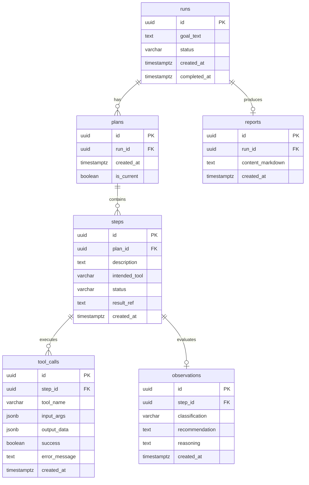
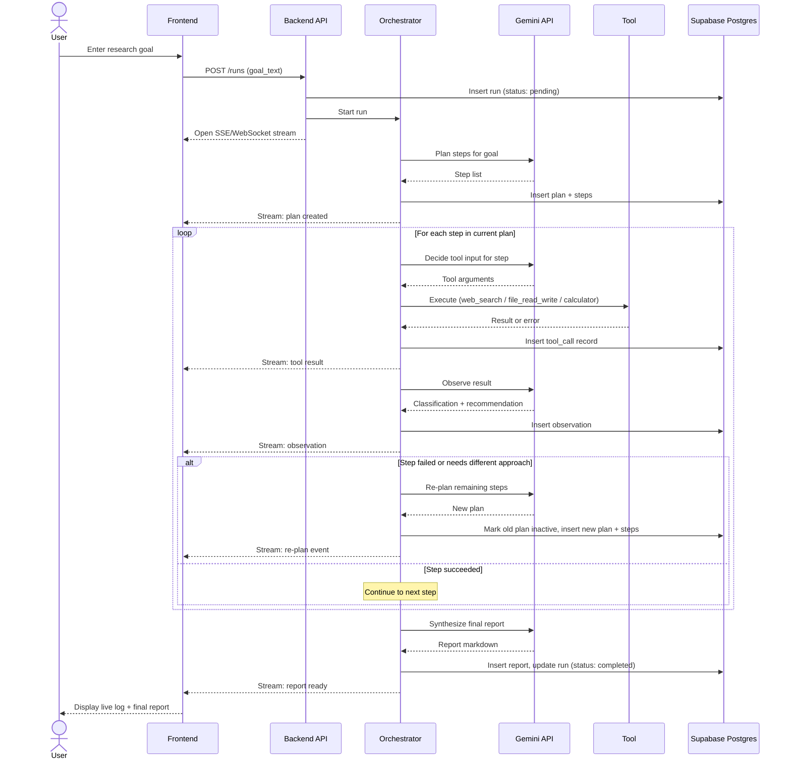
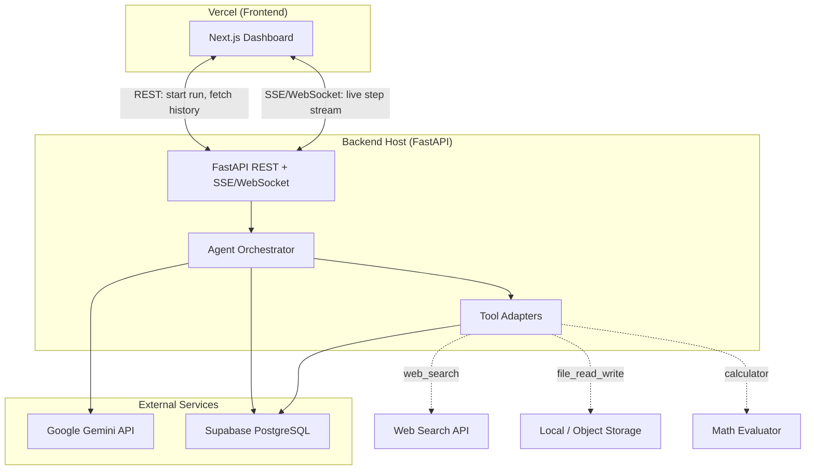

# Design Document — Autonomous Research Agent

## 1. System Overview

You type a research question in plain English — for example, "What was the average rainfall in Tokyo between 2000 and 2020?" — and the system goes to work on its own. Behind the scenes, an AI agent breaks your question into smaller tasks, searches the web, runs calculations, saves notes to files, and checks whether each step succeeded. As it works, you watch a live dashboard that updates in real time with every step the agent takes. When it is done, you receive a structured written report with findings, sources, and conclusions.

---

## 2. Database Schema

### Table purposes

| Table | Purpose |
|-------|---------|
| **runs** | One row per research session. Stores the user's original goal, the current lifecycle status (`pending`, `running`, `completed`, `failed`), and timestamps for when the run started and finished. |
| **plans** | A run may have multiple plans over time (the agent re-plans when a step fails). Each plan row is a snapshot of the agent's strategy at a point in time; `is_current` marks the active plan. |
| **steps** | Individual actions within a plan — e.g. "Search for Tokyo rainfall data" or "Calculate the average." Tracks which tool the agent intends to use, the step status, and an optional reference to saved results. |
| **tool_calls** | The actual execution record when a step invokes a tool. Stores the tool name, input arguments, raw output (or partial output), whether the call succeeded, and any error message. |
| **observations** | After each step, the agent evaluates what happened. The classification (e.g. `success`, `partial`, `failure`) and recommendation (e.g. `continue`, `retry`, `replan`) drive the next action. |
| **reports** | The final markdown report for a completed run — findings, citations, and conclusions synthesized by the agent once all steps are done. |

---

## 3. Sequence Diagram

---

## 4. Architecture Diagram

The live stream connects directly between the Next.js frontend and the FastAPI backend — not through a Vercel serverless proxy — so long-running research runs can push events continuously without timeout issues.

---

## 5. Tool List

| Tool Name | Purpose | Example Input | Example Output | Realistic Failure Mode |
|-----------|---------|---------------|----------------|------------------------|
| **web_search** | Search the public web for information relevant to the research goal. | `{ "query": "Tokyo average annual rainfall 2000-2020 mm" }` | `{ "results": [{ "title": "...", "url": "...", "snippet": "..." }] }` | Rate limit exceeded, no results for an obscure query, or returned pages are paywalled / unreachable. |
| **file_read_write** | Save intermediate notes, read back previously saved context, or write draft report sections to a run-scoped workspace. | `{ "action": "write", "path": "notes/rainfall-sources.md", "content": "Source 1: JMA..." }` | `{ "action": "write", "path": "notes/rainfall-sources.md", "bytes_written": 842 }` | File not found on read, disk quota exceeded, or path escapes the allowed workspace directory. |
| **calculator** | Evaluate mathematical expressions and unit conversions needed for quantitative research. | `{ "expression": "(1520 + 1480 + 1610) / 3" }` | `{ "result": 1536.67, "unit": "mm" }` | Division by zero, unsupported function, or expression references undefined variables from prior steps. |

---

## 6. Agent Loop Description

Imagine you hire a research assistant and give them a question to answer. Here is what they do, step by step:

**Plan.** First, the assistant reads your question and writes a to-do list: "Step 1 — search for rainfall data; Step 2 — calculate the average; Step 3 — write up the answer." They decide which tool to use for each item on the list.

**Act.** The assistant picks the first item and does it — maybe they search the web, save some notes to a file, or run a calculation. Every action is recorded so nothing is lost.

**Observe.** After each action, the assistant pauses and asks: "Did that work? Do I have enough information to move on?" They classify the result as a success, a partial success, or a failure, and decide what to do next.

**Re-plan (when needed).** If a step failed — say, the search returned nothing useful — the assistant does not give up. They revise their to-do list: try a different search query, look in a different place, or break the problem into smaller pieces. The old plan is kept for reference, but a new plan takes over.

**Repeat.** The assistant cycles through act → observe → (maybe re-plan) until every item on the current plan is done, or until they have enough information to answer your question.

**Stop.** The assistant stops when one of these conditions is met: all planned steps succeeded and the question can be answered; they hit a maximum number of steps to avoid running forever; or they determine the question cannot be answered with available tools and report that honestly. They then write a final report summarizing everything they found.

You watch this entire process unfold live on the dashboard — every plan, every search, every calculation, and every time the assistant changes course.
