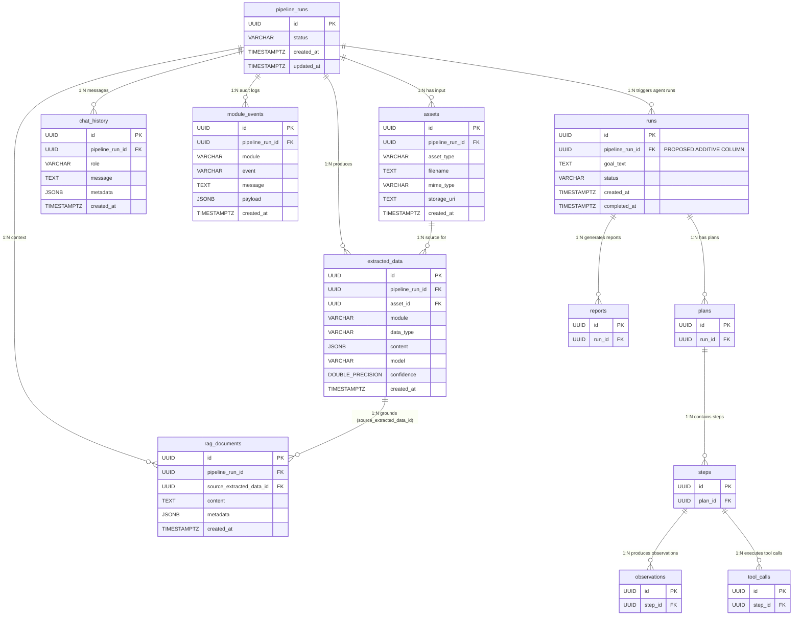

# Additive Shared Supabase PostgreSQL Schema Design (Week 4)

**Document Version:** 1.0.0 (Architecture Proposal)  
**Status:** DESIGN ONLY — PENDING TEAM ALIGNMENT (NO SQL EXECUTED)  
**Scope:** Shared Week 4 Multi-Module Database (Supabase PostgreSQL)  
**Authors:** Muneeb Ur Rehman (Vision), in alignment with Faizan (RAG) and Moeez (Agent/Orchestrator)  
**Related Contract:** [docs/integration/vision-rag-contract.md](file:///d:/visual-product-search/docs/integration/vision-rag-contract.md)

---

## 1. Executive Summary & Design Principles

This document defines the **additive, non-destructive database schema** for the shared Week 4–6 Supabase PostgreSQL database.

### Core Architectural Principles:
1. **Zero Disruption to Existing Agent Tables:** Moeez's existing Agent tables (`runs`, `plans`, `steps`, `observations`, `tool_calls`, `reports`, `alembic_version`) remain completely functional and untouched.
2. **No Duplicate Schema Artifacts:**
   - Conceptual `agent_runs` requirement is mapped directly to Moeez's existing `runs` table.
   - Conceptual `agent_actions` requirement is mapped to Moeez's existing `plans`, `steps`, and `tool_calls` tables.
   - No duplicate `agent_runs` or `agent_actions` tables will be created.
3. **Preservation of Specialized Vector Engines:**
   - **Vision Module:** Continues querying local FAISS `IndexIDMap2` vector indexes (`artifacts/faiss/*`) for the 44,119 product catalog. Product vectors are **not** migrated to PostgreSQL.
   - **RAG Module:** Continues using **Qdrant** for dense knowledge retrieval. PostgreSQL stores relational references and metadata, **not** Qdrant vector embeddings.
4. **Strict Isolation of Catalog vs. Shared State:**
   - Vision's 44k item catalog database (`data/catalog.db` / `catalog_items`) remains independent.
   - Shared Supabase PostgreSQL manages cross-module pipeline orchestration, audit events, and data handoffs.

---

## 2. Existing vs. Proposed Schema Breakdown

### [Existing / Verified] — Agent & Migration Tables (UNTOUCHED)

The following tables exist in the public schema of the Supabase PostgreSQL database and are fully preserved without structural modification:

| Existing Table | Primary Key | Existing Foreign Keys | Purpose / Module Owner | Status |
| :--- | :--- | :--- | :--- | :---: |
| `alembic_version` | `version_num` | None | Database migration tracking | **Preserved** |
| `runs` | `id UUID` | None | Core agent execution runs (Moeez) | **Preserved** (Additive Column Proposed) |
| `plans` | `id UUID` | `run_id -> runs.id` | Multi-step agent planning (Moeez) | **Preserved** |
| `steps` | `id UUID` | `plan_id -> plans.id` | Individual agent plan steps (Moeez) | **Preserved** |
| `observations` | `id UUID` | `step_id -> steps.id` | Step execution results/observations (Moeez) | **Preserved** |
| `tool_calls` | `id UUID` | `step_id -> steps.id` | External tool invocations by agent (Moeez) | **Preserved** |
| `reports` | `id UUID` | `run_id -> runs.id` | Final synthesized agent deliverables (Moeez) | **Preserved** |

### [Existing / Verified] — Existing `runs` Schema Definition:
* `id` (`UUID PRIMARY KEY`)
* `goal_text` (`TEXT NOT NULL`)
* `status` (`VARCHAR NOT NULL`)
* `created_at` (`TIMESTAMPTZ NOT NULL DEFAULT NOW()`)
* `completed_at` (`TIMESTAMPTZ NULL`)

---

## 3. Conceptual-to-Existing Mapping Table

To eliminate duplicate tables and prevent schema bloat, the Week 4 conceptual architecture maps to the actual Supabase database as follows:

| Conceptual Week 4 Requirement | Target Table in Supabase | Ownership | Rationale / Mapping Explanation |
| :--- | :--- | :--- | :--- |
| **`pipeline_runs`** | `pipeline_runs` *(NEW)* | Shared / Orchestrator | Top-level execution trace spanning the complete `Vision → RAG → Agent` pipeline. |
| **`agent_runs`** | `runs` *(EXISTING)* | Moeez (Agent) | Moeez already has a rich, fully functional `runs` table with associated plans, steps, and tool calls. Linking `runs` to `pipeline_runs` via a nullable FK satisfies this requirement without duplicate tables. |
| **`agent_actions`** | `plans`, `steps`, `tool_calls` *(EXISTING)* | Moeez (Agent) | Granular actions, tool executions, and step observations are already modeled with relational integrity across `plans`, `steps`, `observations`, and `tool_calls`. |
| **`assets`** | `assets` *(NEW)* | Vision (Muneeb) / Shared | Multimodal input files (e.g. uploaded user query images) tracked with MIME types and storage URIs. |
| **`extracted_data`** | `extracted_data` *(NEW)* | Vision (Muneeb) | Structured visual search results (`primary_match`, `matches`, `confidence`). Handed off to RAG via `extracted_data.id`. |
| **`rag_documents`** | `rag_documents` *(NEW)* | Faizan (RAG) | Structured contextual chunks, knowledge representations, and citations associated with the pipeline run. |
| **`chat_history`** | `chat_history` *(NEW)* | Faizan (RAG) / Orchestrator | Multi-turn conversational session history and turn-level prompts/responses. |
| **`module_events`** | `module_events` *(NEW)* | Shared Audit Layer | Unified audit trail recording `started`, `completed`, and `failed` events for all modules to power the combined dashboard. |

---

## 4. Proposed Schema Additions & Modifications

> [!IMPORTANT]
> The following table structures and alter statements are **proposals** for team alignment. No SQL will be executed until Faizan and Moeez approve.

### 4.1. Proposed Additive Modification to Existing `runs` Table

Add a single nullable foreign key to link an agent run to its parent end-to-end pipeline trace:

```sql
-- [PROPOSED ADDITIVE ALTERATION]
ALTER TABLE runs 
ADD COLUMN IF NOT EXISTS pipeline_run_id UUID NULL 
REFERENCES pipeline_runs(id) ON DELETE SET NULL;

CREATE INDEX IF NOT EXISTS idx_runs_pipeline_run_id ON runs(pipeline_run_id);
```

* **Backward Compatibility:** When `pipeline_run_id` is `NULL`, existing standalone agent runs continue working without error.
* **Delete Rule:** `ON DELETE SET NULL` ensures that cleaning up a pipeline run does not destroy historical standalone agent records.

---

### 4.2. New Shared Integration Tables (Detailed DDL Proposals)

#### 1. `pipeline_runs` (Parent Orchestration Trace)
Top-level container for an end-to-end multi-agent execution cycle (`Vision → RAG → Agent`).

```sql
CREATE TABLE IF NOT EXISTS pipeline_runs (
    id UUID PRIMARY KEY DEFAULT gen_random_uuid(),
    status VARCHAR(64) NOT NULL DEFAULT 'created', -- 'created', 'processing', 'completed', 'failed'
    created_at TIMESTAMPTZ NOT NULL DEFAULT NOW(),
    updated_at TIMESTAMPTZ NOT NULL DEFAULT NOW()
);

-- Note: updated_at DEFAULT NOW() sets the initial creation timestamp.
-- Subsequent timestamp refreshes on update are managed by the application layer.
CREATE INDEX IF NOT EXISTS idx_pipeline_runs_status ON pipeline_runs(status);
```

#### 2. `assets` (Multimodal Ingestion Storage)
Stores references to raw inputs (such as user-uploaded images) processed during a pipeline run.

```sql
CREATE TABLE IF NOT EXISTS assets (
    id UUID PRIMARY KEY DEFAULT gen_random_uuid(),
    pipeline_run_id UUID NOT NULL REFERENCES pipeline_runs(id) ON DELETE CASCADE,
    asset_type VARCHAR(64) NOT NULL DEFAULT 'query_image',
    filename TEXT NOT NULL,
    mime_type VARCHAR(64) NOT NULL,
    storage_uri TEXT NOT NULL,
    created_at TIMESTAMPTZ NOT NULL DEFAULT NOW()
);

CREATE INDEX IF NOT EXISTS idx_assets_pipeline_run_id ON assets(pipeline_run_id);
```

#### 3. `extracted_data` (Vision Output & Vision → RAG Handoff)
Stores structured candidate product matches and visual similarity scores output by the Vision module.

```sql
CREATE TABLE IF NOT EXISTS extracted_data (
    id UUID PRIMARY KEY DEFAULT gen_random_uuid(),
    pipeline_run_id UUID NOT NULL REFERENCES pipeline_runs(id) ON DELETE CASCADE,
    asset_id UUID NULL REFERENCES assets(id) ON DELETE SET NULL,
    module VARCHAR(32) NOT NULL DEFAULT 'vision',
    data_type VARCHAR(64) NOT NULL DEFAULT 'visual_product_search_matches',
    content JSONB NOT NULL,
    model VARCHAR(64) NOT NULL,
    confidence DOUBLE PRECISION NOT NULL,
    created_at TIMESTAMPTZ NOT NULL DEFAULT NOW()
);

CREATE INDEX IF NOT EXISTS idx_extracted_data_pipeline_run_id ON extracted_data(pipeline_run_id);
CREATE INDEX IF NOT EXISTS idx_extracted_data_asset_id ON extracted_data(asset_id);
```

* **Handoff Identity:** `extracted_data.id` is returned in the Vision API response as `extracted_data_id`.
* **JSONB Payload (`content`):** Stores `{ "primary_match": {...}, "matches": [...] }`.
* **Confidence Metric:** Stores the scalar Rank-1 cosine similarity score ($[0, 1]$ range).

#### 4. `rag_documents` (RAG Context & Knowledge Store)
Stores text chunks, product descriptions, or knowledge context retrieved by Faizan's RAG module for agent grounding.

```sql
CREATE TABLE IF NOT EXISTS rag_documents (
    id UUID PRIMARY KEY DEFAULT gen_random_uuid(),
    pipeline_run_id UUID NOT NULL REFERENCES pipeline_runs(id) ON DELETE CASCADE,
    source_extracted_data_id UUID NULL REFERENCES extracted_data(id) ON DELETE SET NULL,
    content TEXT NOT NULL,
    metadata JSONB NULL,
    created_at TIMESTAMPTZ NOT NULL DEFAULT NOW()
);

CREATE INDEX IF NOT EXISTS idx_rag_documents_pipeline_run ON rag_documents(pipeline_run_id);
CREATE INDEX IF NOT EXISTS idx_rag_documents_source_extracted ON rag_documents(source_extracted_data_id);
```

* **Lineage:** `source_extracted_data_id` establishes clear provenance back to the Vision module's candidate search result.
* **Vector Separation:** Qdrant continues handling high-dimensional vector embeddings; PostgreSQL stores relational text and references.

#### 5. `chat_history` (Conversational State)
Maintains user queries and conversational dialogue associated with a pipeline run.

```sql
CREATE TABLE IF NOT EXISTS chat_history (
    id UUID PRIMARY KEY DEFAULT gen_random_uuid(),
    pipeline_run_id UUID NOT NULL REFERENCES pipeline_runs(id) ON DELETE CASCADE,
    role VARCHAR(16) NOT NULL, -- 'user', 'assistant', 'system'
    message TEXT NOT NULL,
    metadata JSONB NULL,
    created_at TIMESTAMPTZ NOT NULL DEFAULT NOW()
);

CREATE INDEX IF NOT EXISTS idx_chat_history_pipeline_run ON chat_history(pipeline_run_id);
```

#### 6. `module_events` (Unified Audit & Dashboard Log)
Audit logging table that enables the unified monitoring dashboard across all modules.

```sql
CREATE TABLE IF NOT EXISTS module_events (
    id UUID PRIMARY KEY DEFAULT gen_random_uuid(),
    pipeline_run_id UUID NOT NULL REFERENCES pipeline_runs(id) ON DELETE CASCADE,
    module VARCHAR(32) NOT NULL, -- 'vision', 'rag', 'agent', 'orchestrator'
    event VARCHAR(32) NOT NULL,  -- 'started', 'completed', 'failed', etc.
    message TEXT NOT NULL,
    payload JSONB NULL,
    created_at TIMESTAMPTZ NOT NULL DEFAULT NOW()
);

CREATE INDEX IF NOT EXISTS idx_module_events_pipeline_run ON module_events(pipeline_run_id);
CREATE INDEX IF NOT EXISTS idx_module_events_module ON module_events(module);
```

---

## 5. Table Ownership & Write Boundaries

| Database Table | Origin / Layer | Primary Writer | Primary Readers |
| :--- | :--- | :--- | :--- |
| `pipeline_runs` | Shared Layer | Orchestrator / API Gateway | All Modules, Dashboard |
| `assets` | Shared Layer | Vision (Muneeb) | Vision, RAG, Dashboard |
| `extracted_data` | Shared Layer | Vision (Muneeb) | RAG (Faizan), Dashboard |
| `rag_documents` | Shared Layer | RAG (Faizan) | Agent (Moeez), Dashboard |
| `chat_history` | Shared Layer | RAG (Faizan) / Orchestrator | Agent (Moeez), Dashboard |
| `module_events` | Shared Layer | Vision, RAG, Agent (All) | Unified Dashboard |
| `runs` | Existing Agent | Agent (Moeez) | Agent, Dashboard |
| `plans` | Existing Agent | Agent (Moeez) | Agent, Dashboard |
| `steps` | Existing Agent | Agent (Moeez) | Agent, Dashboard |
| `observations` | Existing Agent | Agent (Moeez) | Agent, Dashboard |
| `tool_calls` | Existing Agent | Agent (Moeez) | Agent, Dashboard |
| `reports` | Existing Agent | Agent (Moeez) | Agent, Dashboard |
| `alembic_version` | Infrastructure | Alembic Migration Runner | System |

---

## 6. Mermaid Entity-Relationship (ER) Diagram



---

## 7. End-to-End Vision → RAG → Agent Data Flow

```mermaid
flowchart TD
    subgraph 0_Client_Orchestrator ["0. Client / Orchestrator"]
        PR[Create pipeline_runs row<br/>id: pipeline_run_id]
        IMG[User uploads image + pipeline_run_id]
    end

    subgraph 1_Vision_Module ["1. Vision Module (Muneeb)"]
        EV_V_START[module_events: 'vision' / 'started']
        AST[Insert assets row -> asset_id]
        FAISS_SRCH[CLIP / ResNet FAISS Vector Search<br/>Local FAISS IndexIDMap2]
        DB_CAT[Catalog DB Metadata Hydration<br/>data/catalog.db]
        EXT_INS[Insert extracted_data row<br/>content: primary_match + matches<br/>confidence: score<br/>-> extracted_data_id]
        EV_V_END[module_events: 'vision' / 'completed']
        V_RESP[Return API Response<br/>extracted_data_id, primary_match, matches]
    end

    subgraph 2_RAG_Module ["2. RAG Module (Faizan)"]
        EV_R_START[module_events: 'rag' / 'started']
        FETCH_EXT[Read extracted_data by extracted_data_id]
        QDRANT[Qdrant Knowledge Retrieval]
        RAG_INS[Insert rag_documents row<br/>source_extracted_data_id]
        EV_R_END[module_events: 'rag' / 'completed']
    end

    subgraph 3_Agent_Module ["3. Agent Module (Moeez)"]
        EV_A_START[module_events: 'agent' / 'started']
        AGT_RUN[Insert runs row<br/>pipeline_run_id: pipeline_run_id]
        AGT_PLAN[Insert plans & steps]
        AGT_TOOL[Execute tool_calls & record observations]
        AGT_REP[Insert reports row]
        EV_A_END[module_events: 'agent' / 'completed']
    end

    PR --> IMG
    IMG --> EV_V_START
    EV_V_START --> AST
    AST --> FAISS_SRCH
    FAISS_SRCH --> DB_CAT
    DB_CAT --> EXT_INS
    EXT_INS --> EV_V_END
    EV_V_END --> V_RESP

    V_RESP --> EV_R_START
    EV_R_START --> FETCH_EXT
    FETCH_EXT --> QDRANT
    QDRANT --> RAG_INS
    RAG_INS --> EV_R_END

    EV_R_END --> EV_A_START
    EV_A_START --> AGT_RUN
    AGT_RUN --> AGT_PLAN
    AGT_PLAN --> AGT_TOOL
    AGT_TOOL --> AGT_REP
    AGT_REP --> EV_A_END
```



---

## 8. Summary of Decisions Requiring Multi-Module Alignment

Before applying migrations to the Supabase PostgreSQL database, alignment is requested from **Faizan** and **Moeez** on:

1. **Additive `runs.pipeline_run_id` Column:**
   - Confirmation that adding `pipeline_run_id UUID NULL REFERENCES pipeline_runs(id) ON DELETE SET NULL` to Moeez's `runs` table is acceptable and causes no conflicts with Alembic migrations.
2. **`pipeline_runs.status` Standard Enum / String Values:**
   - Proposed values: `'started'`, `'processing'`, `'completed'`, `'failed'`.
3. **`module_events.event` Vocabulary:**
   - Standardized lifecycle verbs: `'started'`, `'completed'`, `'failed'`, with optional sub-events (e.g. `'tool_called'`, `'chunk_retrieved'`).
4. **`assets.storage_uri` Format:**
   - Confirmation whether `storage_uri` should reference local workspace relative paths (`/shared/assets/...`) or Supabase Storage bucket URLs.
5. **RAG Source Linkage:**
   - Confirmation from Faizan that `rag_documents.source_extracted_data_id` pointing to `extracted_data.id` fulfills RAG's provenance requirements.
6. **Alembic vs. Direct Migration Strategy:**
   - Agreement on whether Moeez's existing Alembic suite in the shared repository should generate the migration script for the new tables or if a standalone SQL migration will be used.

---

*Schema design documented on: Week 4 Day 2.*
