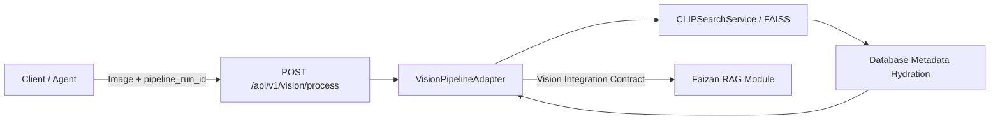

# Vision Module Integration Contract (Week 4)

**Document Version:** 1.0.0  
**Module:** Visual Product Search (Vision)  
**Author:** Muneeb Ur Rehman  
**Target Consumer:** Faizan (RAG Module) / Multi-Agent Orchestrator  
**Team Pipeline Flow:** `Vision → RAG → Agent`  

---

## 1. Module Responsibility

The **Vision Module** serves as the initial perception and retrieval stage in the end-to-end multi-agent pipeline. Specifically, the module:

1. **Receives an Image**: Accepts user-uploaded query images (JPG, PNG, WebP) or direct catalog image references.
2. **Executes Visual Product Search**: Leverages the existing Weeks 1–3 visual search engine (OpenCLIP ViT-B-32 / ResNet-50 visual feature extractors and FAISS vector index).
3. **Retrieves Ranked Catalog Items**: Retrieves the top-$K$ visually similar catalog products from the 44k+ e-commerce product database.
4. **Transforms to Stable Integration Contract**: Adapts raw visual search matches into an immutable, structured integration contract format.
5. **Hands Off Structured Data to RAG**: Passes verified product attributes, category hierarchy, visual similarity metrics, and candidate alternatives directly to Faizan's RAG module.

> [!IMPORTANT]
> **Zero Disruption to Existing System**: All completed Weeks 1–3 functionality—including OpenCLIP ViT-B-32, ResNet-50, FAISS indexes (`artifacts/faiss/*`), 44,119 item database, HSV re-ranking, evaluation pipelines, existing `/search` and `/api/v1/search` endpoints, and the standalone frontend—remains completely intact and unmodified.

---

## 2. Existing Search Implementation

The existing Week 1–3 backend architecture is structured as follows:

* **Endpoints**: `/search` and `/api/v1/search` are defined in `app/main.py`.
* **Execution Orchestration**: Both routes delegate request handling to the core function `_execute_search(...)`.
* **Retrieval & Embeddings**:
  * `CLIPSearchService` generates 512-dimensional $L_2$-normalized OpenCLIP embeddings and queries `artifacts/faiss/clip.index`.
  * `ResNetSearchService` generates 2048-dimensional $L_2$-normalized ResNet-50 embeddings and queries `artifacts/faiss/resnet.index`.
* **ID Mapping**: FAISS `IndexIDMap2` stores and directly returns integer IDs mapped 1:1 to database primary keys (`catalog_items.id`).
* **Metadata Attachment**: `fetch_catalog_items_by_ids(...)` in `app/db/database.py` performs order-preserving batch lookups from PostgreSQL / SQLite to hydrate product attributes.
* **Response Serialization**: Formats results using `SearchResultItem` and `SearchResponse` defined in `app/schemas/search.py`.

---

## 3. Official Vision Integration Response

The Vision module exposes its output using the following standardized JSON contract:

```json
{
  "pipeline_run_id": "9b1deb4d-3b7d-4bad-9bdd-2b0d7b3dcb6d",
  "producer": "vision",
  "status": "completed",
  "match_status": "matched",
  "query_filename": "query.jpg",
  "model_used": "OpenCLIP_ViT_B_32",
  "top_k": 5,
  "total_results": 5,
  "primary_match": {
    "rank": 1,
    "catalog_item_id": 7393,
    "product_id": 37779,
    "external_id": "37779",
    "filename": "37779.jpg",
    "product_display_name": "John Players Men Check Green Shirt",
    "category": "Apparel",
    "sub_category": "Topwear",
    "article_type": "Shirts",
    "base_colour": "Green",
    "gender": "Men",
    "season": "Summer",
    "usage": "Casual",
    "image_url": "/catalog-images/37779.jpg",
    "similarity_score": 0.9179
  },
  "matches": [
    {
      "rank": 1,
      "catalog_item_id": 7393,
      "product_id": 37779,
      "external_id": "37779",
      "filename": "37779.jpg",
      "product_display_name": "John Players Men Check Green Shirt",
      "category": "Apparel",
      "sub_category": "Topwear",
      "article_type": "Shirts",
      "base_colour": "Green",
      "gender": "Men",
      "season": "Summer",
      "usage": "Casual",
      "image_url": "/catalog-images/37779.jpg",
      "similarity_score": 0.9179
    },
    {
      "rank": 2,
      "catalog_item_id": 14210,
      "product_id": 18245,
      "external_id": "18245",
      "filename": "18245.jpg",
      "product_display_name": "Locomotive Men Check Green Casual Shirt",
      "category": "Apparel",
      "sub_category": "Topwear",
      "article_type": "Shirts",
      "base_colour": "Green",
      "gender": "Men",
      "season": "Fall",
      "usage": "Casual",
      "image_url": "/catalog-images/18245.jpg",
      "similarity_score": 0.8842
    }
  ],
  "error": null
}
```

### Top-Level Field Descriptions

| Field | Type | Description |
| :--- | :--- | :--- |
| `pipeline_run_id` | `str` (UUID) | Unique execution trace identifier shared across `Vision → RAG → Agent`. Preserved from request or auto-generated. |
| `producer` | `str` | Fixed identifier: `"vision"`. |
| `status` | `str` | Overall stage execution status: `"completed"` or `"failed"`. |
| `match_status` | `str` | Semantic visual matching assessment. Must strictly be one of: `"matched"`, `"no_useful_match"`, or `"not_evaluated"`. |
| `query_filename` | `str` | Name of the query image or catalog reference. |
| `model_used` | `str` | Name of the feature extractor used (e.g. `"OpenCLIP_ViT_B_32"` or `"ResNet_50"`). |
| `top_k` | `int` | Number of candidate products requested. |
| `total_results` | `int` | Number of candidate products returned in `matches`. |
| `primary_match` | `Optional[Dict]` | The Rank-1 candidate match dictionary. `null` when no matches exist or upon error. |
| `matches` | `List[Dict]` | Complete list of all Top-$K$ ranked candidate products. |
| `error` | `Optional[Dict]` | `null` on success; structured error payload (`{"code": str, "message": str}`) on failure. |

> [!NOTE]
> **Semantic Match Status Values**:
> * `"matched"`: Search completed successfully and candidate products were retrieved.
> * `"no_useful_match"`: Visual search executed, but candidates did not meet a defined relevance threshold (reserved for future threshold policy).
> * `"not_evaluated"`: Search could not run due to input, decoding, or runtime processing errors.
> *(Do **NOT** use `"no_match"`).*

---

## 4. Successful Search Behavior

When an image is processed successfully:

* **HTTP Status Code**: `200 OK`
* **Execution Status**: `status = "completed"`
* **Match Status**: `match_status = "matched"`
* **Trace ID**: `pipeline_run_id` matches the incoming ID or returns the newly assigned UUID.
* **Payload Structure**:
  * `primary_match`: Contains the highest-ranked candidate (`rank == 1`).
  * `matches`: Contains the ordered list of all retrieved candidates ($1 \dots K$).
  * `error`: `null`.

---

## 5. Invalid-Image & Error Behavior

### Existing Codebase Inspection Findings

In the existing Weeks 1–3 search service, errors return standard HTTP exceptions:

| Condition | Current HTTP Code | Current Message / Trigger |
| :--- | :---: | :--- |
| **No file or filename provided** | `400 Bad Request` | `"Either an image file or a catalog_filename must be provided."` |
| **Uploaded file is empty** | `400 Bad Request` | `"Uploaded file is empty."` |
| **Corrupt or unreadable image** | `400 Bad Request` | `"Uploaded file is not a valid or supported image."` |
| **Catalog filename not found** | `404 Not Found` | `"Catalog image '<filename>' not found."` |
| **Invalid `top_k` parameter** | `400 Bad Request` | `"top_k must be an integer between 1 and 50."` |
| **Search / FAISS runtime error** | `500 Server Error` | `"Visual search processing error (<model>): <details>"` |

### Future Integration Error Response

For the RAG integration endpoint (`POST /api/v1/vision/process`), errors will be returned as a predictable structured JSON payload:

```json
{
  "pipeline_run_id": "9b1deb4d-3b7d-4bad-9bdd-2b0d7b3dcb6d",
  "producer": "vision",
  "status": "failed",
  "match_status": "not_evaluated",
  "query_filename": "corrupt_image.png",
  "model_used": "OpenCLIP_ViT_B_32",
  "top_k": 5,
  "total_results": 0,
  "primary_match": null,
  "matches": [],
  "error": {
    "code": "INVALID_IMAGE",
    "message": "The uploaded image could not be decoded or is corrupted."
  }
}
```

---

## 6. No-Useful-Match Behavior & Threshold Policy

> [!WARNING]
> **No Validated Similarity Threshold Currently Exists**
> 
> Inspection of the codebase and evaluation benchmarks confirms that the visual search engine **does not** currently have a validated or hardcoded similarity threshold for declaring a match "not useful".
>
> In FAISS index retrieval:
> * The index always returns the Top-$K$ nearest geometric neighbors regardless of distance.
> * Cosine similarities naturally vary between ~0.20 and 0.95 depending on domain, query clarity, and category density.
> * Hardcoding arbitrary cutoff thresholds (e.g. `0.70`) without empirical team agreement would cause false negatives on valid queries.

### Policy Rules for Integration

1. **Do Not Invent Thresholds**: No ad-hoc cutoff values will be introduced without team consensus and validation data.
2. **Preserve Ranked Candidates**: The Vision module will pass the ordered candidates and their numerical `similarity_score` values to RAG.
3. **Future Extension**: The contract explicitly supports `match_status = "no_useful_match"` once a measured confidence rule or threshold is established.
4. **Interpretation Notice**: Downstream modules (RAG and Agent) must understand that candidate rank 1 is the mathematically closest item in the catalog, but rank 1 does not guarantee an identical semantic match if similarity is low.

---

## 7. Vision → RAG Handoff

Faizan's RAG module receives a clean, enriched catalog representation for each candidate product:

### Fields Provided to RAG

* **`product_id` / `catalog_item_id`**: Canonical product identifiers.
* **`product_display_name`**: Human-readable product title (e.g., `"John Players Men Check Green Shirt"`).
* **`category` & `sub_category`**: Taxonomy classification (e.g., `"Apparel"` $\rightarrow$ `"Topwear"`).
* **`article_type`**: Specific item type (e.g., `"Shirts"`, `"Jeans"`).
* **`base_colour`**: Color descriptor (e.g., `"Green"`, `"Navy Blue"`).
* **`gender`**: Target demographic (e.g., `"Men"`, `"Women"`, `"Unisex"`).
* **`season` & `usage`**: Contextual tags (e.g., `"Summer"`, `"Casual"`, `"Formal"`).
* **`image_url`**: Path to access the catalog item image.
* **`similarity_score`**: Continuous similarity value ($[0, 1]$).
* **`matches`**: Ranked alternative products to enable multi-item grounding and fallback context.

### What RAG Does NOT Need to Handle

Faizan's module is fully decoupled from computer vision internals and does **not** need to manage:
* OpenCLIP / ResNet embedding tensors or architectures
* FAISS vector indices, $L_2$ normalization, or nearest neighbor graphs
* Image resizing, normalization, or PIL decoding
* HSV color histograms or re-ranking weights
* Visual evaluation benchmarks

---

## 8. Proposed Week 4 Adapter Architecture

### Endpoint Concept
`POST /api/v1/vision/process`



### Proposed File Structure

#### New Files to Create in Future Implementation:
* `app/schemas/vision_pipeline.py` — Defines `VisionProcessRequest`, `VisionMatchItem`, and `VisionProcessResponse`.
* `app/services/vision_pipeline_adapter.py` — Encapsulates trace ID handling, calls `CLIPSearchService`, and maps search results to the integration contract.

#### Existing File with Minimal Future Addition:
* `app/main.py` — Mounts the single route `POST /api/v1/vision/process` (approx. 20 lines).

#### Untouched Existing Files:
* `app/schemas/search.py`
* `app/schemas/auth.py`
* `app/services/clip_search_service.py`
* `app/services/resnet_search_service.py`
* `app/services/embedding_service.py`
* `app/services/resnet_embedding_service.py`
* `app/services/reranking_service.py`
* `app/db/database.py`
* All FAISS index artifacts (`artifacts/faiss/*`)
* Frontend application (`frontend/*`)
* Evaluation scripts & benchmark datasets (`evaluation/*`, `scripts/*`)

---

## 9. Ownership Boundary

### Muneeb Ur Rehman (Vision Module) Owns:
* Query image decoding, format validation, and integrity checks.
* Execution of embedding generation and FAISS vector retrieval.
* Transformation of search results into the official Vision integration contract.
* Vision status reporting, trace ID propagation, and vision-specific error payloads.
* Future database event writes for the Vision stage once the shared database schema is defined.

### Muneeb Does NOT Own:
* RAG knowledge retrieval, vector search over text documents, or prompt generation.
* Grounded text synthesis, citations, or hallucination verification.
* Agent decision logic, planning algorithms, or tool routing.
* End-to-end multi-agent pipeline orchestration.

---

## 10. Day 1 Completion Checklist

- [x] Existing `/search` response inspected
- [x] Vision output fields selected
- [x] Successful-search behavior defined
- [x] Invalid-input behavior defined
- [x] No-useful-match behavior defined
- [x] Vision → RAG handoff defined
- [x] Ownership boundary defined
- [x] Week 1–3 internals protected from unnecessary changes
- [ ] Team contract approval
- [ ] Shared database/API contract finalized
- [ ] Vision adapter implementation
